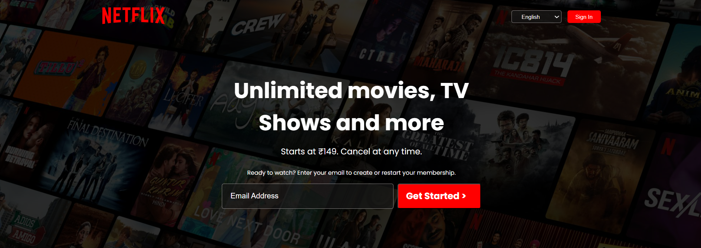
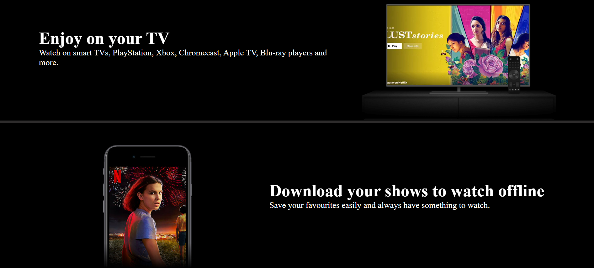
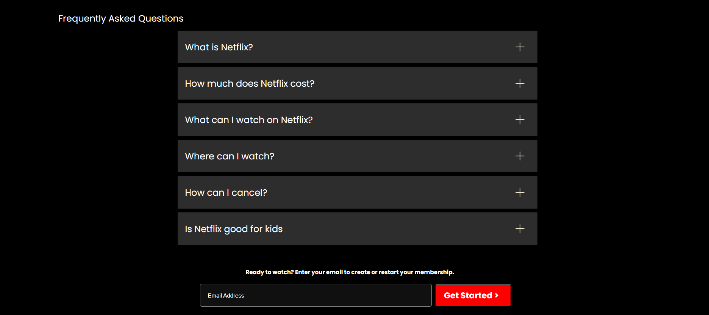

# 🎬 Netflix Clone

A responsive front-end clone of the Netflix homepage built using **HTML** and **CSS**. This project mimics the look and layout of Netflix’s landing page and is designed to work across all screen sizes.

## 🚀 Features

- Fully responsive design (mobile, tablet, desktop)
- Navigation bar with logo and sign-in button
- Hero section with background image and call-to-action
- Placeholder sections for trending and featured content
- Smooth layout and hover effects

## 🛠️ Built With

- HTML5  
- CSS3 (Flexbox, Grid, Media Queries)

## 📸 Screenshots

## 💻 How to Use

1. Clone the repository:
   git clone https://github.com/Bishnu-prasad-Sahu/A-Fully-Responsive-Netflix-Frontend-Clone.git
2. Open the folder and run the project:
    cd netflix-clone
3. Open index.html in your browser.

You can see the website liek at [text](https://bishnu-prasad-sahu.github.io/A-Fully-Responsive-Netflix-Frontend-Clone/)

📂 Folder Structure

    netflix-clone/
    
    ├── index.html
    ├── style.css
    └── screenshots.png

Author : Bishnu Prasad Sahu